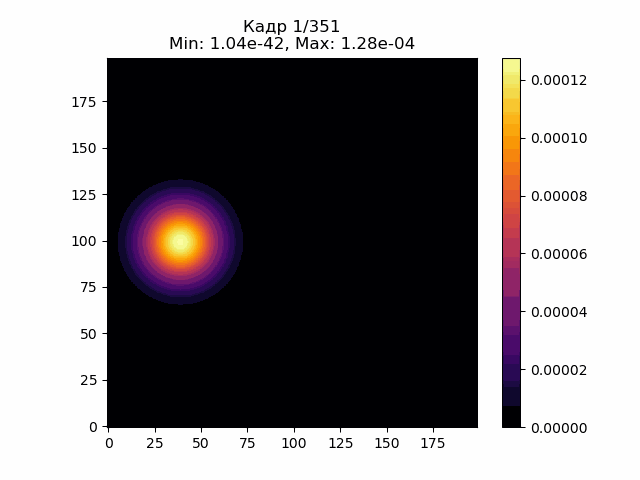

# Neutron-diffraction-public
## Вопрос по выбору на государственный экзамен по физике **МФТИ**, 5 семестр

---

>[!warning]
>К сожалению, исходный код не может быть размещен публично по просьбе одного из людей, участвовавших в проекте. Ниже размещен отчет по работе с подробным описанием всех использованных методов.

---

[Отчет по работе](main.pdf)
